# Beveiliging: netstelsels, gevaren van stroom en beveiligingstoestellen

## Vertrekpunt: wat proberen we te vermijden?

Voor we het over netstelsels en zekeringen hebben, eerst de vraag waar het allemaal om draait: wat gebeurt er als iets misgaat, bijvoorbeeld wanneer de isolatie van een toestel defect raakt en de behuizing onder spanning komt te staan? Alles wat in dit hoofdstuk volgt (netstelsels, zekeringen, automaten, differentieelschakelaars) is een antwoord op die ene vraag: hoe zorgen we ervoor dat zo'n fout geen slachtoffers maakt en geen brand veroorzaakt?

## De gevaren van elektrische stroom door het lichaam

Hoe gevaarlijk een elektrische schok is, hangt vooral af van de stroomsterkte die door het lichaam vloeit (uitgedrukt in mA) en van hoe lang die stroom blijft vloeien. De internationale norm **IEC 60479-1** verdeelt de effecten van wisselstroom op het lichaam in vier zones, van "geen reactie" tot "levensgevaarlijk". Binnen die zones is er één punt waarvoor gedetailleerd onderzoek bestaat met een duidelijk verschil tussen man en vrouw: de **loslaatgrens** (let-go current), het punt waarop spierkramp het onmogelijk maakt om een spanningvoerend voorwerp zelf nog los te laten. Dit onderzoek (Dalziel) toont aan dat vrouwen gemiddeld bij een lagere stroomsterkte al niet meer kunnen loslaten dan mannen, vermoedelijk door het gemiddelde verschil in lichaamsmassa en spierkracht.

| Stroomsterkte (Ib) | Effect op het lichaam | Verschil man / vrouw |
|---|---|---|
| < 0,5 mA | Meestal geen enkele reactie waarneembaar | Geen relevant verschil gedocumenteerd |
| 0,5 - 5 mA | Voelbare tinteling of prikkeling, geen schadelijke fysiologische effecten | Geen relevant verschil gedocumenteerd |
| 6 mA | Grens waaronder zo goed als iedereen nog zelf kan loslaten | 99,5% van de vrouwen kan hier nog loslaten |
| 9 mA | Grens waaronder zo goed als iedereen nog zelf kan loslaten | 99,5% van de mannen kan hier nog loslaten |
| ≈ 10,5 mA | Gemiddelde loslaatgrens: vanaf hier lukt het bij de helft van de mensen niet meer om zelf los te laten | Gemiddelde bij vrouwen ≈ 10,5 mA |
| ≈ 16 mA | Gemiddelde loslaatgrens | Gemiddelde bij mannen ≈ 15,9 mA |
| 15 - 23 mA | Spierkramp, mogelijk beginnende ademhalingsproblemen | Bovengrens loslaatgrens: vrouw ≈ 15 mA, man ≈ 23 mA |
| 20 - 30 mA | Ademhalingsmoeilijkheden: spierkramp kan de ademhalingsspieren blokkeren | Geen apart gedocumenteerd verschil |
| > 30 mA | Vanaf hier is een dodelijke afloop bij een stroom van hand naar voet reëel mogelijk, tenzij de stroom snel wordt uitgeschakeld. **Dit is exact de reden waarom de wettelijke bijkomende bescherming (differentieelschakelaar) op maximaal 30 mA is vastgelegd** | - |
| 50 - 100 mA (bij langere blootstelling) | Sterk stijgend risico op kamerfibrilleren (ventrikelfibrillatie), een levensbedreigende hartritmestoornis | - |
| 100 - 200 mA | Grote kans op hartritmestoornissen en hartstilstand | - |
| > 200 mA tot enkele A | Zware inwendige verbranding en hartstilstand, dood zeer waarschijnlijk | - |

Deze tabel verklaart meteen waarom een differentieelschakelaar (aardlekschakelaar) voor bijkomende bescherming standaard op **30 mA** wordt ingesteld: dat is ruim onder de grens van 30 mA waarbij een dodelijke afloop reëel wordt, en dus ruim voor het lichaam in het echt gevaarlijke gebied terechtkomt.

Ter vergelijking, dezelfde indeling zoals ze courant in vakliteratuur wordt weergegeven:

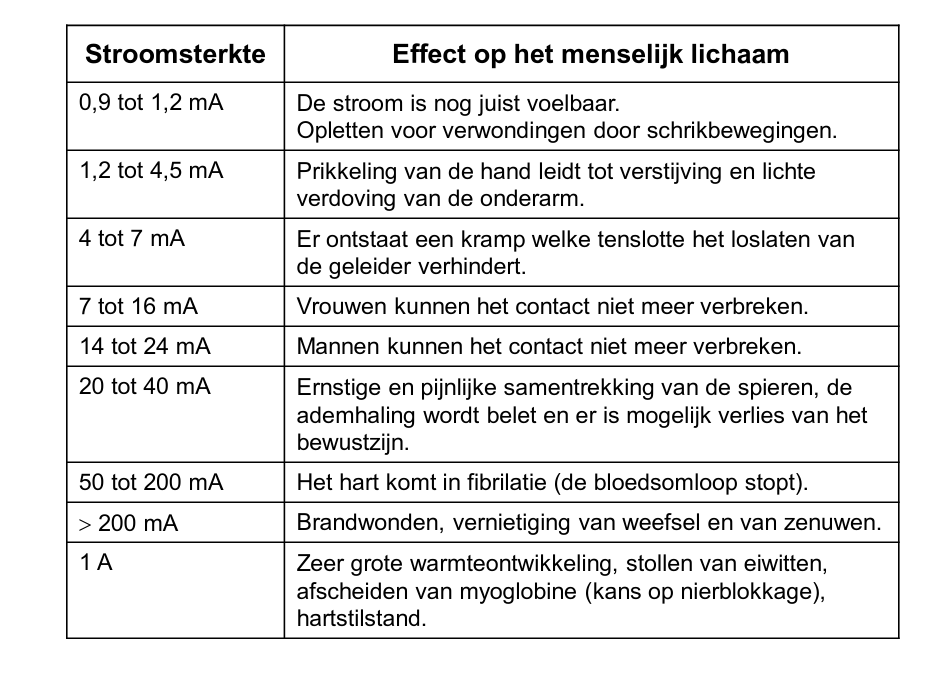

**Bronnen**: ABB, [Bescherming tegen aardfouten met aardlekschakelaars](https://library.e.abb.com/public/90eb73c52c9e0eb8c1257cf500425f03/1SPC801069B3101%20info%20aardlek.pdf) (gebaseerd op IEC 60479-1); C.F. Dalziel, onderzoek naar de loslaatgrens (let-go current) bij mannen en vrouwen, zoals hernomen in [IAEI Magazine - The History of GFCI Protection in the NEC](https://iaeimagazine.org/issue/2024-summer/the-history-of-gfci-protection-in-the-nec/).

## Netstelsels: hoe is de aarding van een net opgezet?

Een netstelsel beschrijft hoe de nulleider (N) en de aarding (PE) van een elektrisch net ten opzichte van elkaar en ten opzichte van de aarde zijn opgebouwd. Dit bepaalt rechtstreeks hoe je een installatie moet beveiligen tegen onrechtstreekse aanraking. Het AREI onderscheidt drie families: **TN**, **TT** en **IT**. De eerste letter zegt hoe het net (de bron) geaard is, de tweede letter zegt hoe de massa's (de behuizingen van de toestellen) geaard zijn.

- **T** (bron): het sterpunt van de bron (transfo) is rechtstreeks geaard
- **I** (bron): het sterpunt van de bron is geïsoleerd van de aarde, of verbonden via een hoge impedantie
- **T** (massa's): de massa's van de toestellen zijn rechtstreeks geaard
- **N** (massa's): de massa's zijn verbonden met de nulleider van het net (die op zijn beurt bij de bron geaard is)

Onze laagspanningsnetten zijn **driefasig**: de transfo levert drie fasen (L1, L2, L3) plus een nulleider (N), samen goed voor 230V tussen een fase en de nulleider, en 380V (eigenlijk 400V, maar 380V is de gangbare term) tussen twee fasen onderling. Vanaf hier tekenen we daarom telkens alle drie de fasen mee, samen met **twee soorten fouten**:

- een **aardfout** (rood): een fase komt in contact met de massa van een toestel, en de foutstroom zoekt een weg terug naar de bron via PE (of via de grond bij TT). Dit is de fout waarbij een persoon gevaar loopt.
- een **kortsluiting tussen twee fasen** (paars, 380V): bijvoorbeeld doordat de isolatie tussen twee fasegeleiders beschadigd raakt. Deze fout heeft **niets te maken met de aarding** van het net (ze gebeurt dus op exact dezelfde manier bij TN, TT of IT), maar is minstens even gevaarlijk door de zeer hoge kortsluitstroom en het risico op brand en vlamboog.

**Kleurcode in de diagrammen**: enkel de kleur van **N** (blauw) en **PE** (groen-geel) ligt wettelijk vast. Zodra een kring een nulgeleider bevat, is blauw **voorbehouden** voor die nulgeleider en mag het niet voor een fasegeleider gebruikt worden (is er geen nulgeleider, dan mag blauw wel voor iets anders dienen). Geel-groen is op dezelfde manier voorbehouden voor de beschermingsgeleider. Voor de fasegeleiders L1, L2 en L3 legt het AREI zelf **geen specifieke kleur per fase** op: bruin/zwart/grijs is wel de gangbare praktijkconventie (IEC 60446), maar geen AREI-verplichting. In onderstaande diagrammen gebruiken we die conventie omdat ze het meest herkenbaar is:

- **L1** - bruin (conventie, niet verplicht)
- **L2** - zwart (conventie, niet verplicht)
- **L3** - grijs (conventie, niet verplicht)
- **N** - blauw (**verplicht**, indien de kring een nulgeleider heeft)
- **PE / PEN** - groen (werkelijk groen-geel, **verplicht**)
- **Aardfout / foutstroom naar een massa** - rood
- **Kortsluiting tussen twee fasen (380V)** - paars
- **Eerste fout in een IT-net (kleine, ongevaarlijke lekstroom)** - oranje

### TN-S

Bij TN-S lopen de nulleider (N) en de aardgeleider (PE) als **twee volledig gescheiden geleiders** van de bron tot bij het toestel. Er is één aardingspunt, bij de bron.

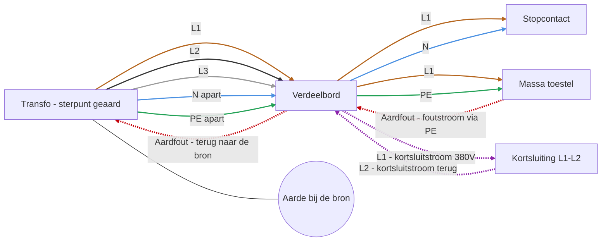

Omdat de PE-geleider metallisch teruggaat naar de bron, vormt de aardfout een laagohmige lus: de foutstroom wordt groot genoeg zodat een gewone automaat of smeltveiligheid de fout snel uitschakelt.

Dezelfde opbouw, in de klassieke vakliteratuur-stijl getekend: de basisopbouw, de kortsluitstroom, de verliesstroom (aardfout) en tot slot met een differentieelschakelaar die de verliesstroom detecteert:

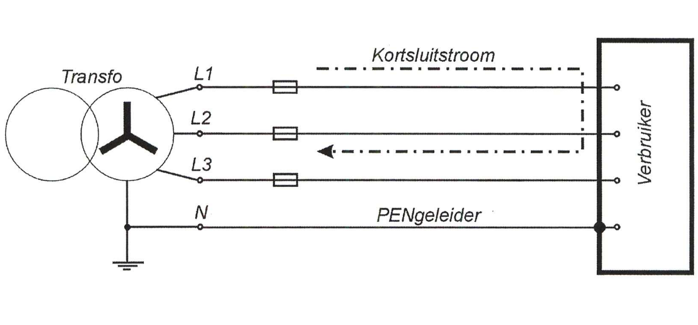
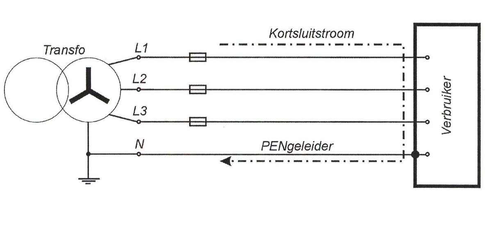
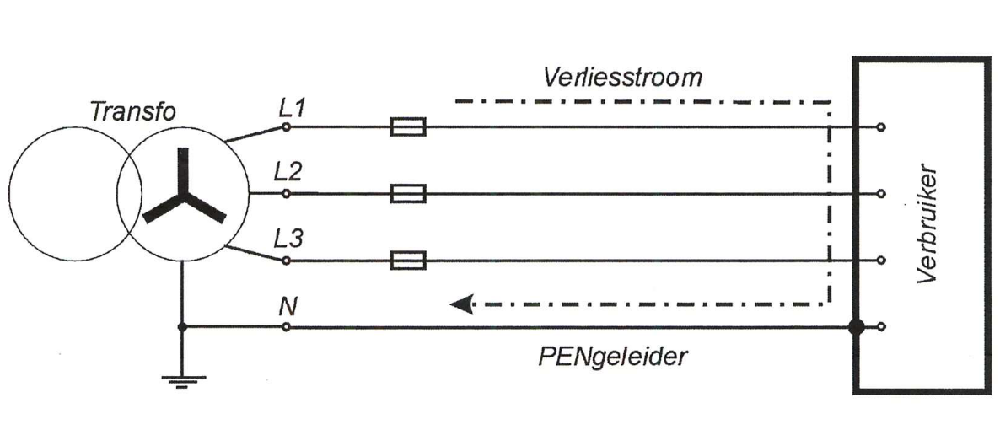
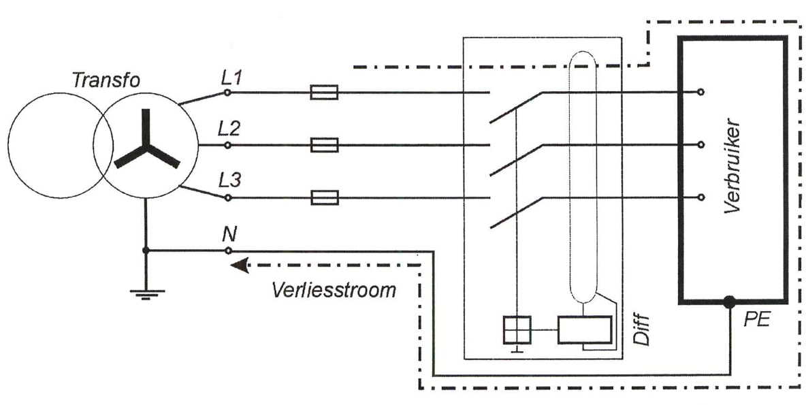

**Waar wordt dit gebruikt?** In België typisch verder in een **privaat net** (een site met een eigen transformatorcabine) na het splitsingspunt van een TN-C-S-aansluiting, dus bij industriële of tertiaire gebouwen, en zeker aangeraden in installaties met veel gevoelige elektronica (bijvoorbeeld datacenters), omdat daar geen stroom over een gedeelde PEN-geleider mag lopen. Een gewone Belgische woning op het openbare net werkt hier niet mee, die is TT (zie verder).

### TN-C

Bij TN-C worden de functie van nulleider en aardgeleider **gecombineerd in één geleider**, de PEN-geleider, over het volledige traject. Ook de aardfout (rood) loopt hier terug via diezelfde gecombineerde PEN-geleider.

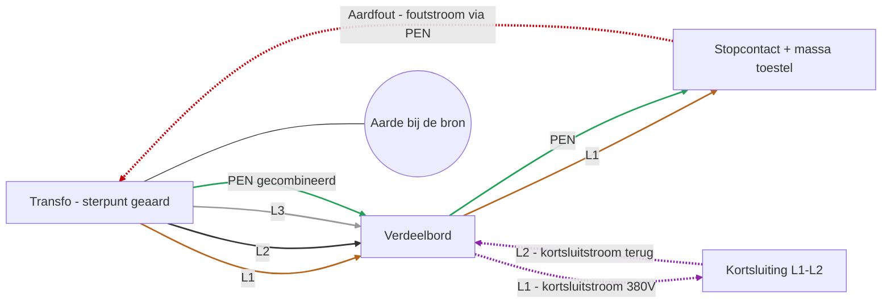

De kortsluitstroom en de verliesstroom bij TN-C, in dezelfde stijl:

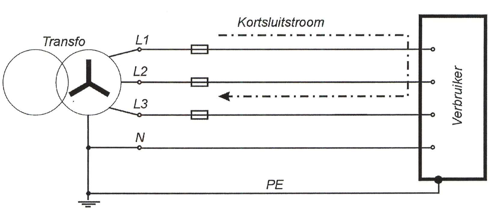
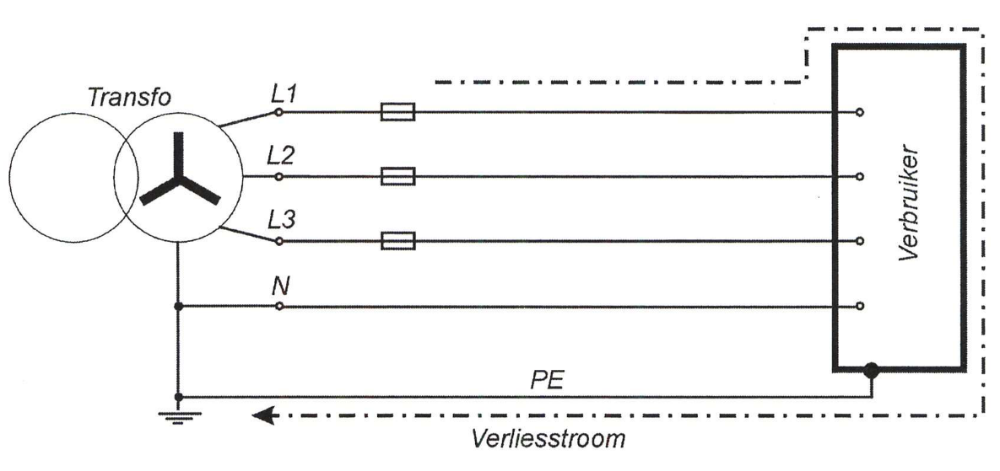

**Waar wordt dit gebruikt?** In het openbare laagspanningsdistributienet zelf (bijvoorbeeld de kabels van Fluvius of ORES tussen de wijktransfo en de straat) en voor straatverlichting. TN-C is **verboden in de eindkringen van een gebouw** na de teller: een breuk in die ene gecombineerde geleider zou daar te gevaarlijk zijn voor personen.

### TN-C-S

TN-C-S is een combinatie: **vanaf de bron tot een bepaald splitsingspunt** loopt een gecombineerde PEN-geleider (zoals TN-C), en **vanaf dat splitsingspunt tot het toestel** worden N en PE terug gescheiden (zoals TN-S).

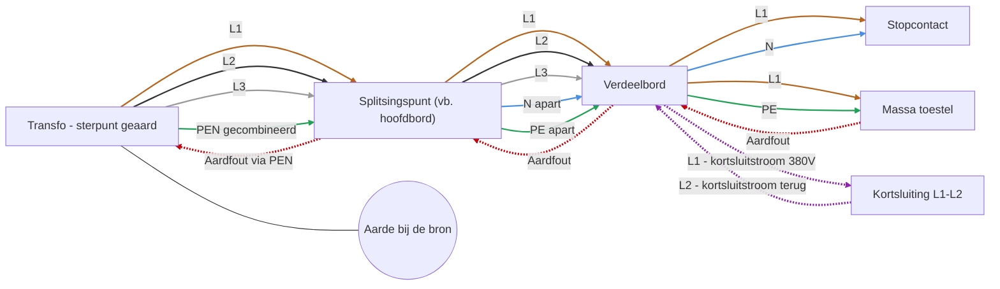

Een overzicht dat de volledige keten toont: van de bron met een gecombineerde PEN, over een eerste splitsing (verbruiker 1, bijvoorbeeld openbare verlichting), tot een tweede aftakking met een eigen differentieelschakelaar (verbruiker 3):

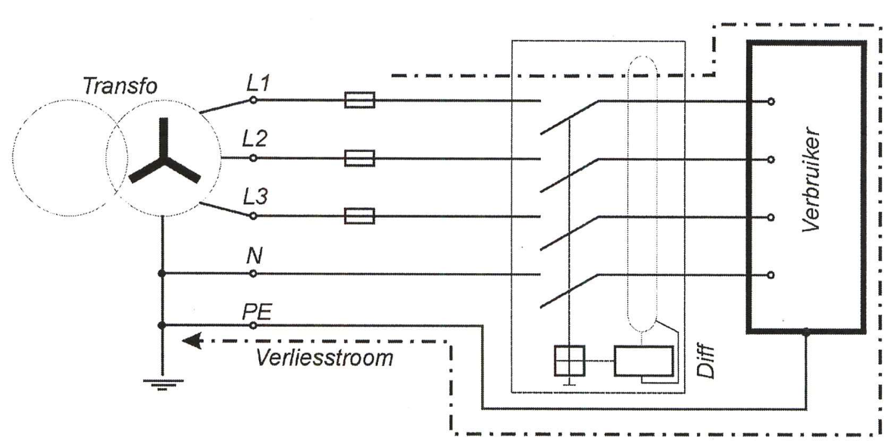

**Waar wordt dit gebruikt?** In België **niet** bij gewone woningen op het openbare laagspanningsnet: die zijn zoals verder beschreven vrijwel altijd TT. TN-C-S (en TN in het algemeen) komt bij ons vooral voor in **private netten**, dus bij grotere sites met een eigen transformatorcabine (industriële of tertiaire gebouwen): de eigenaar van die cabine beheert dan zelf de PEN-splitsing en de aarding, zoals hierboven getekend. In andere landen, zoals Nederland en Duitsland, is TN-C-S wel de standaard tot bij de woning, dus deze verdeling verschilt per land.

### TT

Bij TT is het sterpunt van de bron geaard, maar de massa's van de installatie worden verbonden met een **eigen, lokale aardelektrode**, volledig los van de aarding bij de bron. Er loopt dus geen aardgeleider van de bron naar de installatie: de aardfout (rood) moet hier terug via de grond zelf, tussen de twee afzonderlijke aardelektrodes.

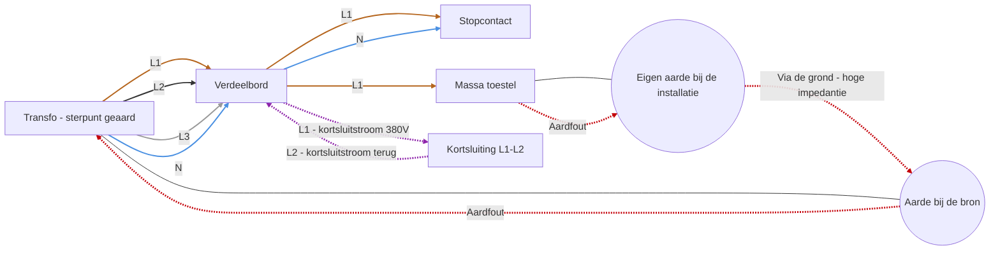

Omdat de foutstroom door de grond moet, met een veel hogere impedantie dan een metalen geleider, kan een gewone overstroombeveiliging een aardfout hier niet altijd snel genoeg detecteren. Daarom is in een TT-net een **differentieelstroominrichting altijd noodzakelijk** om de installatie te beschermen. Merk op dat de kortsluiting tussen L1 en L2 (paars) hier op exact dezelfde manier verloopt als bij TN-S: die fout gaat immers niet via de aarding.

**Waar wordt dit gebruikt?** Dit is het **standaard netstelsel voor Belgische woningen** aangesloten op het openbare laagspanningsnet van de netbeheerder (Fluvius, Sibelga of ORES): de netbeheerder aardt zijn eigen net, maar elke woning krijgt een eigen, onafhankelijke aardelektrode. TT is dus niet een uitzondering of iets van vroeger, maar de normale situatie voor zo goed als elke particuliere aansluiting in België. Precies daarom verplicht het AREI in elke Belgische huisinstallatie standaard een 300 mA-differentieel (en bijkomend 30 mA voor stopcontacten): zonder die differentieel zou een aardfout hier immers vaak niet snel genoeg gedetecteerd worden.

Een reëel voorbeeld van hoe dit bij de netbeheerder is opgebouwd: het verdeelnet levert een PEN, maar een woning (verbruiker 2) krijgt daarnaast een eigen "klantaarding", los van de PEN van het net. Merk op dat andere aansluitingen, zoals openbare verlichting (verbruiker 1), wel rechtstreeks op de PEN kunnen blijven aangesloten zonder eigen aarde, net omdat daar geen personen in de buurt van de massa's staan zoals in een woning:

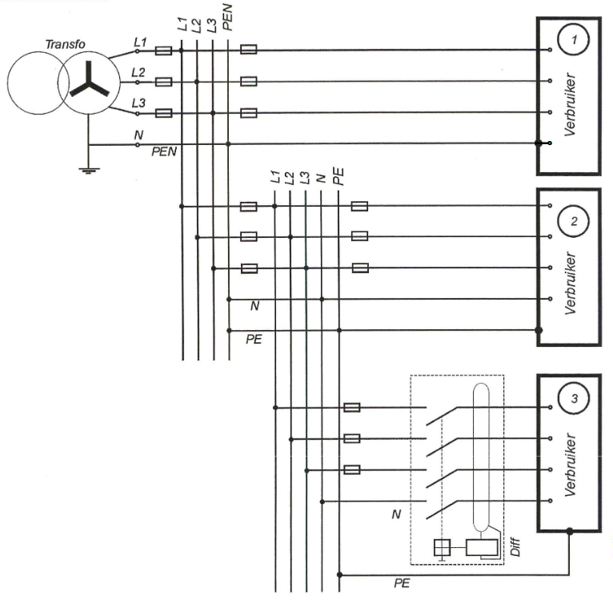

### IT

Bij IT is het sterpunt van de bron **niet** rechtstreeks geaard (geïsoleerd, of via een hoge impedantie), en hebben de massa's een eigen lokale aardelektrode, net als bij TT. IT-netten worden vaak zonder nulleider uitgevoerd (enkel de drie fasen), wat we hieronder ook zo tekenen. Een eerste fout (oranje) veroorzaakt hier maar een kleine, ongevaarlijke lekstroom via de isolatie-impedantie van het net, niet de grote foutstroom die je bij TN of TT zou krijgen.

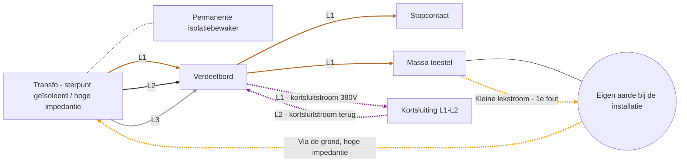

In een IT-net veroorzaakt een eerste aardfout nog geen gevaarlijke situatie en moet de installatie niet meteen uitschakelen, maar een **permanente isolatiebewaker** waarschuwt zodra er een eerste fout optreedt, zodat die hersteld kan worden voor er een tweede fout bijkomt. Pas bij een tweede, gelijktijdige fout ontstaat een echte, gevaarlijke foutstroomlus die wel snel moet worden uitgeschakeld. Een kortsluiting tussen twee fasen (paars) is hier wel meteen even gevaarlijk als bij TN of TT, want die fout heeft niets met de aarding te maken.

De basisopbouw en de (kleine, ongevaarlijke) verliesstroom bij een eerste fout:

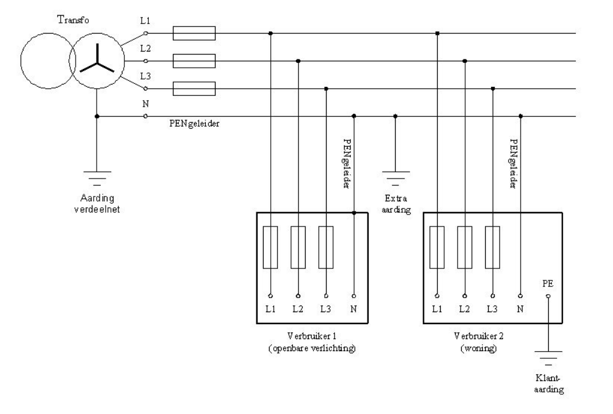
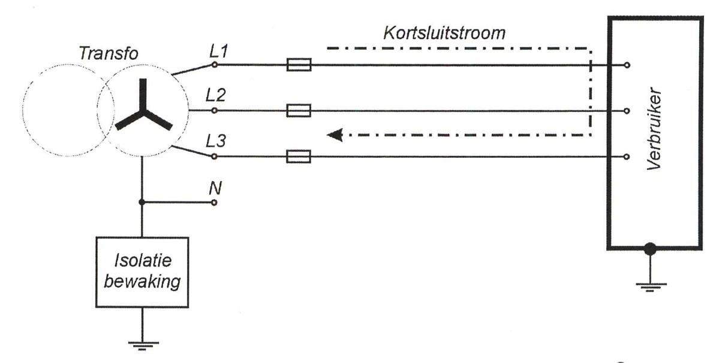

**Waar wordt dit gebruikt?** Overal waar de stroom nooit zomaar mag uitvallen bij één fout: operatiezalen en andere kritische ruimtes in ziekenhuizen, bepaalde industriële processen met continue productie (bijvoorbeeld chemie), en sommige scheeps- of offshore-installaties.

**Bron voor de Belgische praktijk (TT als standaard voor woningen, TN-C-S enkel bij private netten):** [Atlas Contrôle - Netstelsels TT, TN, IT: verschillen, aardingssysteem in België & AREI](https://www.atlascontrole.be/nl/netstelsels-tt-tn-it/).

## Waartegen beveiligen we een installatie?

- **Overbelasting**: te veel stroom gedurende te lange tijd door een leiding, met oververhitting en uiteindelijk brandgevaar tot gevolg.
- **Kortsluiting**: een zeer hoge stroom gedurende zeer korte tijd, met een risico op mechanische en thermische schade en brand.
- **Onrechtstreekse aanraking**: een persoon raakt een massa aan die door een fout onder spanning kwam te staan (bijvoorbeeld de metalen behuizing van een defect toestel).
- **Rechtstreekse aanraking**: een persoon raakt rechtstreeks een geleider aan die normaal onder spanning staat.
- **Brand door lekstroom**: een kleine, aanhoudende lekstroom (vanaf ongeveer 300 mA, zie AREI) die in een vochtige of stoffige omgeving voor oververhitting en brand kan zorgen.

## Hoe beveiligen we: de toestellen

### Smeltveiligheden en automatische schakelaars

Deze beschermen tegen **overbelasting en kortsluiting**: ze onderbreken de stroombaan wanneer de stroom te hoog wordt. Welke grootte je mag gebruiken, hangt af van de doorsnede van de kabel: dit staat in **tabel 4.11** van het AREI (zie AREI.md, onderafdeling 4.4.1.5), bijvoorbeeld een kabel van 2,5 mm² mag maximaal beveiligd worden met een smeltveiligheid van 16 A of een automatische schakelaar van 20 A.

De uitschakeltijd van een automaat hangt af van hoe groot de stroom is ten opzichte van zijn nominale waarde: hoe groter de overstroom, hoe sneller hij uitschakelt. Dit wordt weergegeven in een uitschakelkarakteristiek:

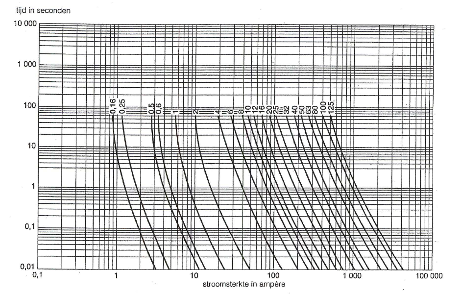
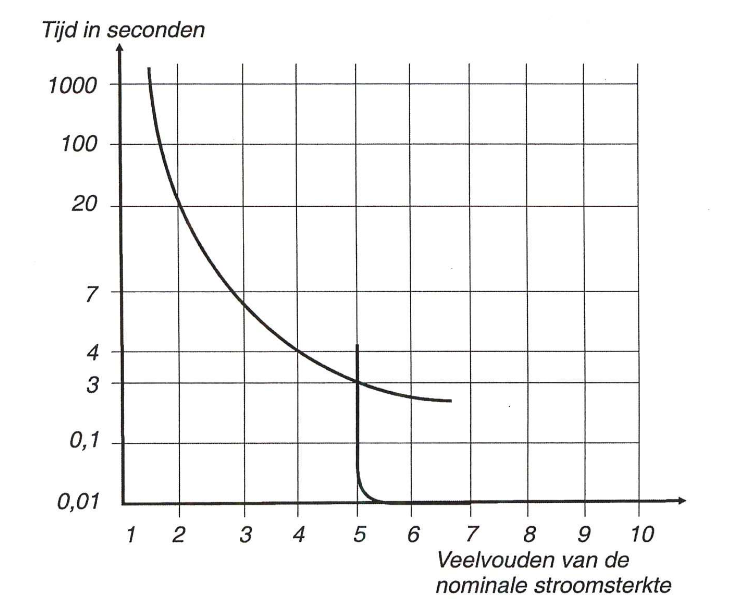

### Differentieelstroominrichtingen (aardlekschakelaars)

Deze beschermen tegen **onrechtstreekse (en deels rechtstreekse) aanraking**: ze vergelijken de stroom die binnenkomt met de stroom die terug buitengaat, en schakelen uit zodra er een verschil (een lekstroom) optreedt, bijvoorbeeld omdat er stroom via een persoon of via een fout naar de aarde wegvloeit.

- Elke huisinstallatie heeft minstens **één differentieelstroominrichting van maximaal 300 mA** aan het begin van de installatie.
- Voor stopcontacten en voor toestellen zoals wasmachines, droogkasten en afwasmachines in een badkamer is **bijkomend een differentieelstroominrichting van maximaal 30 mA** verplicht: dit is de grens die in de tabel hierboven het verschil maakt tussen "gevaarlijk" en "veilig, zelfs bij langere blootstelling".

Hoe een differentieelschakelaar reageert op de twee soorten fouten van hierboven: bij een kortsluiting tussen fasen (geen verschil in binnen- en buitengaande stroom) schakelt hij niet zelf uit (dat is het werk van de automaat/smeltveiligheid), maar bij een verliesstroom (aardfout) merkt hij het verschil tussen in- en uitgaande stroom en schakelt hij wel uit:

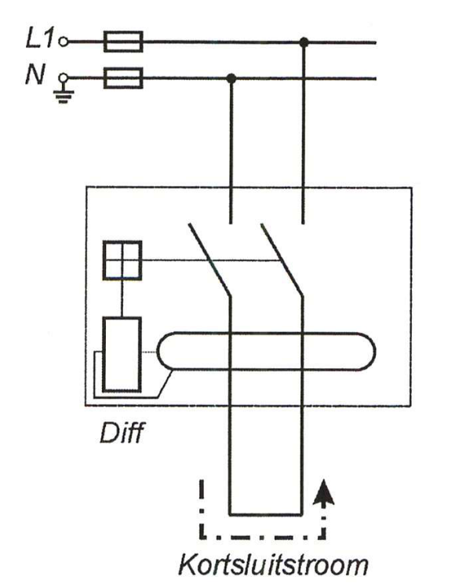
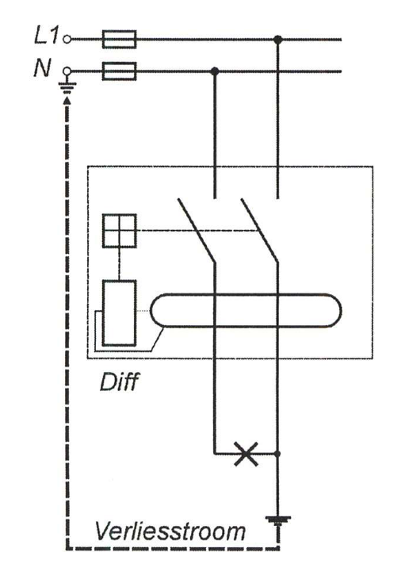

Een badkamer is een goed voorbeeld van een ruimte met extra aardingsvoorschriften: naast de hoofdbeschermingsgeleider is er vaak ook een bijkomende equipotentiale verbinding nodig tussen alle geleidende delen (radiator, bad, leidingen,...):

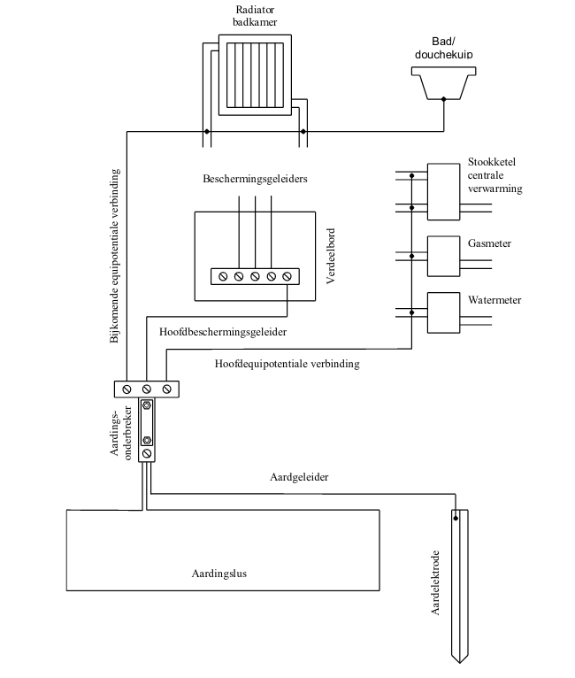

## Hoe sluit je dit op elkaar aan?

In een verdeelkast worden deze beveiligingen na elkaar geplaatst, van grof naar fijn:

1. **Hoofdschakelaar**: schakelt de volledige installatie aan of uit.
2. **Algemene differentieelstroominrichting (300 mA)**: beschermt de volledige installatie tegen grote lekstromen en brandgevaar.
3. **Automatische schakelaars of smeltveiligheden per stroombaan**: elke afzonderlijke kring (verlichting, stopcontacten, een specifiek toestel) krijgt een eigen beveiliging op maat van de kabeldikte van die kring.
4. **Bijkomende differentieelstroominrichtingen (30 mA)**: geplaatst vóór de groepen die stopcontacten of gevoelige toestellen voeden, voor bijkomende bescherming van personen.

Dit is exact wat we in het labo gaan herkennen en aansluiten: eerst de hoofdschakelaar en de algemene 300 mA-differentieel, dan de automaten per kring, en waar nodig een bijkomende 30 mA-differentieel.

Zo ziet dat er schematisch uit in een modulair verdeelbord (elk blokje een automaat of differentieel, met zijn aansluitpunten boven en onder):

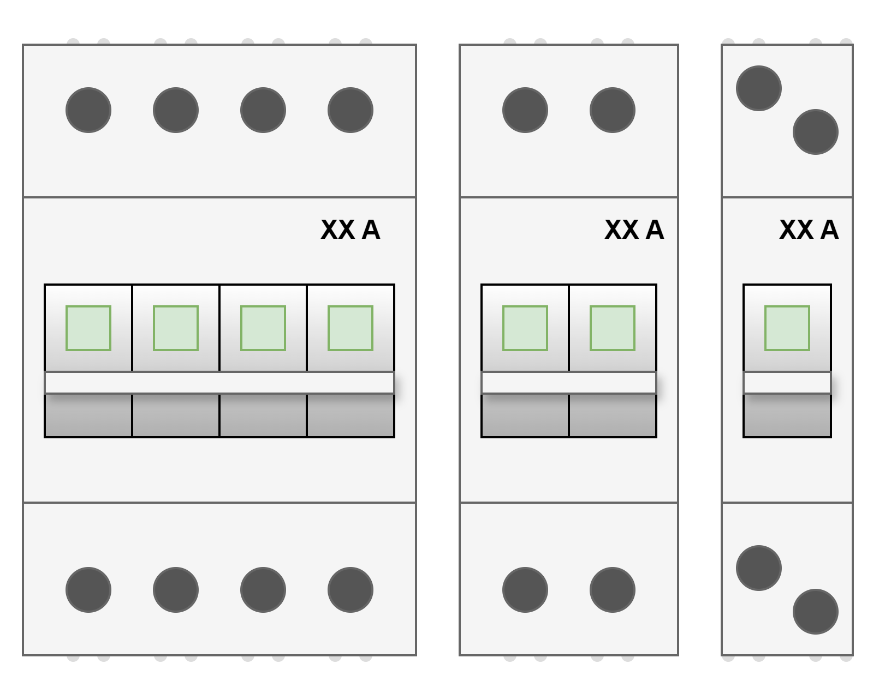
