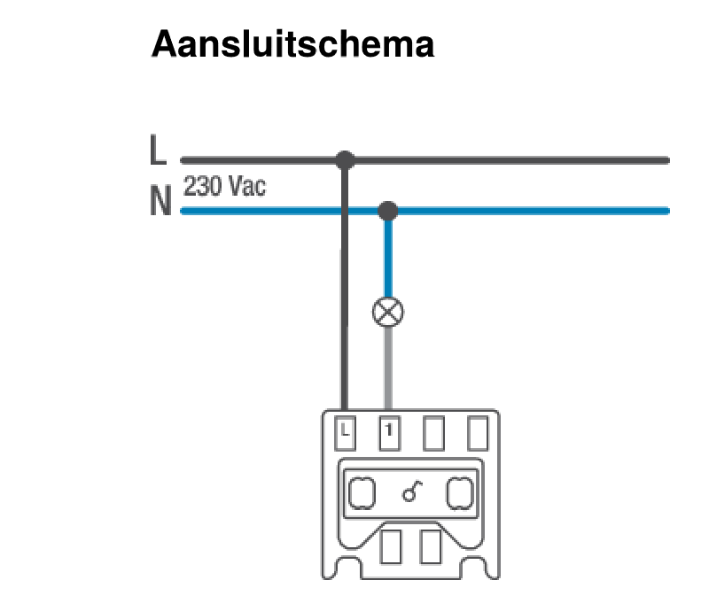
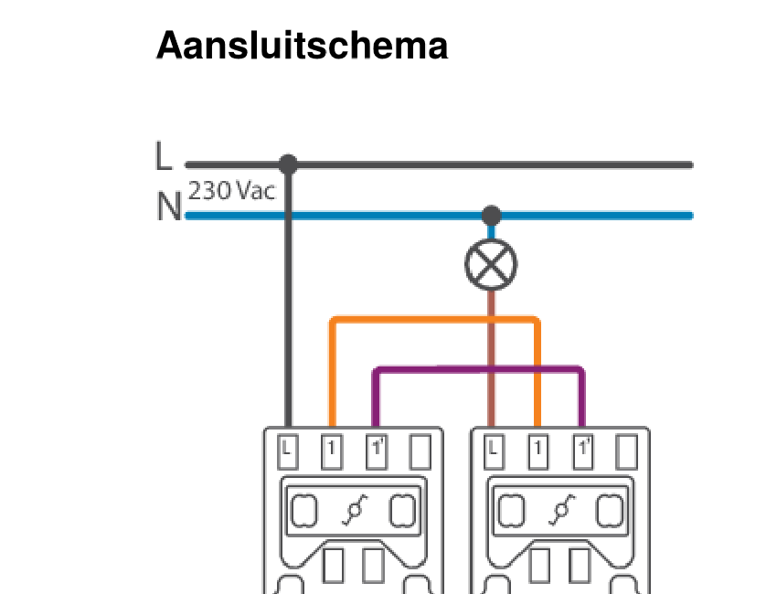
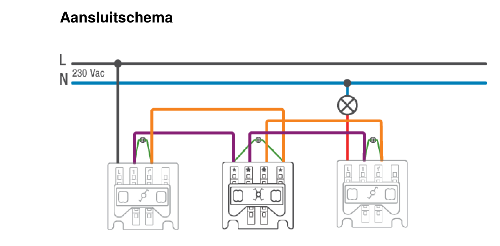

# Niko-schakelaars aansluiten: enkelvoudig, wissel en kruis

## Voor je begint

Dit is je eerste echte bekabelingsoefening. Voor je ook maar één draad vastschroeft:

- **Maak de kring spanningsloos** en controleer dat met een spanningstester, niet enkel door de automaat om te zetten.
- Werk op een **oefenbordje met losse componenten**, niet rechtstreeks in de kast.
- Herbekijk het **stroombaanschema** van de schakeling die je gaat bouwen (zie schemas.md) vóór je begint te bedraden: je weet pas wat je aansluit als je weet hoe het hoort te werken.
- **Gereedschap**: kruisschroevendraaier (de meeste Niko-binnenwerken gebruiken schroefklemmen), striptang, eventueel een krimptang met adereindhulzen als je met soepele draad werkt (zie installatieregels.md, thema "bedrading in het verdeelbord").

**Let op**: Niko gebruikt meerdere productreeksen (Original, Pure, Intense,...) en zowel schroef- als insteekklemmen. De schema's hieronder zijn de **officiële aansluitschema's van Niko zelf** (uit hun datasheets op niko.eu). Controleer bij een ander model altijd het schemaatje dat op de achterkant van het binnenwerk zelf gedrukt staat.

## 1. Enkelvoudige schakelaar

### Het principe

Een enkelvoudige schakelaar heeft **2 klemmen**. Hij onderbreekt enkel de **fase (L)**, nooit de nulgeleider. De nulleider gaat rechtstreeks door naar het lichtpunt en komt nooit bij de schakelaar.

### Klemmen

- **L**: de inkomende fasedraad, van de beveiliging in het bord.
- **1**: de vertrekkende schakeldraad, naar de lamp/het lichtpunt.

### Officieel aansluitschema (Niko 170-71115)

### Stappen

1. Spanningsloos maken en controleren.
2. De inkomende fasedraad (bruin, uit de buis) aansluiten op klem 1.
3. Een nieuwe draad (dezelfde kleur als een schakeldraad, nooit blauw of geel-groen) van klem 2 naar het lichtpunt leggen.
4. De nulgeleider (blauw) rechtstreeks doorverbinden van de voeding naar het lichtpunt, **buiten de schakelaar om**.
5. De aardgeleider (geel-groen), indien aanwezig op het lichtpunt, rechtstreeks doorverbinden.
6. Klemmen stevig aandraaien, geen koperdraad zichtbaar laten buiten de klem.
7. Terug onder spanning zetten en testen.

## 2. Wisselschakeling (1 lichtpunt vanaf 2 plaatsen)

### Het principe

Een wisselschakelaar heeft **3 klemmen**: één voor de inkomende/vertrekkende fase, en twee "wissel"-klemmen die onderling met een tweede wisselschakelaar verbonden worden. Je gebruikt er altijd **twee tegelijk**, in paar.

### Klemmen (typisch op een Niko-binnenwerk)

- **L**: bij de eerste wisselschakelaar, de inkomende fase vanaf de beveiliging.
- **1 en 1'** (soms benoemd als P1/P2): de twee wisselcontacten, verbonden met de overeenkomstige klemmen van de tweede wisselschakelaar.
- Bij de tweede wisselschakelaar komt de vertrekkende schakeldraad naar de lamp op de klem die overeenkomt met "L" op de eerste.

### Officieel aansluitschema (Niko 170-71615)

### Stappen

1. Spanningsloos maken en controleren.
2. De inkomende fase aansluiten op klem **L** van wisselschakelaar 1.
3. Twee verbindingsdraden ("wisseldraden") leggen tussen wisselschakelaar 1 en wisselschakelaar 2: klem **1** van de eerste naar klem **1** van de tweede, en klem **1'** van de eerste naar klem **1'** van de tweede. Verwar deze twee draden niet met de fase: gebruik er een herkenbare, maar niet blauwe of geel-groene kleur voor.
4. Vanaf de klem van wisselschakelaar 2 die overeenkomt met "L", de vertrekkende schakeldraad naar de lamp leggen.
5. De nulgeleider en (indien aanwezig) de aardgeleider rechtstreeks doorverbinden naar het lichtpunt, **buiten beide schakelaars om**, net als bij de enkelvoudige schakelaar.
6. Test vanaf beide plaatsen: de lamp moet vanaf elke wisselschakelaar aan en uit te zetten zijn, ongeacht de stand van de andere.

## 3. Kruisschakeling (1 lichtpunt vanaf 3 of meer plaatsen)

### Het principe

Een kruisschakeling bouw je verder op de wisselschakeling: je **plaatst een kruisschakelaar tussen de twee wisselschakelaars** in. Hij heeft zelf **geen L-klem**: hij schakelt enkel de wisseldraden, niet de fase zelf.

### Klemmen

Op het officiële Niko-binnenwerk (170-71715) zijn de 4 klemmen van de kruisschakelaar **niet genummerd** zoals bij de wisselschakelaar (geen "L, 1, 1'"), maar enkel gemarkeerd met een klein symbool. Dat is geen vergissing: de kruisschakelaar is **symmetrisch opgebouwd**, dus het maakt niet uit welke van de twee linkse klemmen je voor welke wisseldraad van wisselschakelaar 1 gebruikt, zolang je:

- **2 klemmen aan één kant** verbindt met de 2 wisseldraden van wisselschakelaar 1
- **de 2 klemmen aan de andere kant** verbindt met de 2 wisseldraden van wisselschakelaar 2

- De wisselschakelaars blijven ongewijzigd aangesloten zoals hierboven (L op fase, lichtpunt aan de overeenkomstige klem van de tweede).
- In plaats van de twee wisselschakelaars rechtstreeks met elkaar te verbinden, onderbreek je die twee wisseldraden en leid je ze via de kruisschakelaar: de 2 wisseldraden van wisselschakelaar 1 naar de 2 klemmen aan één kant, de 2 wisseldraden van wisselschakelaar 2 naar de 2 klemmen aan de andere kant.
- Wil je vanaf een **4de of 5de plaats** kunnen schakelen, plaats je gewoon een extra kruisschakelaar in serie tussen de twee wisselschakelaars.

### Officieel aansluitschema (Niko 170-71715)

### Stappen

1. Spanningsloos maken en controleren.
2. Wisselschakelaar 1 en 2 aansluiten zoals bij de wisselschakeling (L op fase bij 1, lichtpunt bij 2).
3. De twee wisseldraden niet rechtstreeks tussen wisselschakelaar 1 en 2 leggen, maar elk via de kruisschakelaar laten lopen (zie klemmenoverzicht hierboven).
4. Nulgeleider en aardgeleider, zoals altijd, rechtstreeks naar het lichtpunt, buiten alle schakelaars om.
5. Test vanaf alle drie de plaatsen, in elke mogelijke volgorde van bediening: de lamp moet steeds correct schakelen, ongeacht welke schakelaar je als laatste bediende.

## Bedradingslijst als controlemiddel

Voor je een schakeling fysiek bouwt, is het een goede gewoonte om eerst een **bedradingslijst** op te stellen (zie schemas.md): elke draad een nummer geven, met van/naar. Dat dwingt je om de volledige schakeling al op papier correct te hebben vóór je een schroevendraaier vastneemt, en is je referentie als er bij het testen iets niet werkt.

## Veelgemaakte fouten

- De nulgeleider per ongeluk via de schakelaar laten lopen in plaats van rechtstreeks naar het lichtpunt: de lamp lijkt dan soms te werken, maar de behuizing van het lichtpunt blijft onder spanning staan zolang de schakelaar "uit" staat maar de nulleider wel nog fase voert. Gevaarlijk en een duidelijke reden tot afkeuring.
- Wisseldraden en fase door elkaar halen: gebruik een consistente, herkenbare kleur voor de wisseldraden, en controleer altijd met een spanningstester vóór je verder test.
- De twee wisseldraden van wisselschakelaar 1 niet samen aan dezelfde kant van de kruisschakelaar aansluiten (bv. één links, één rechts): de schakeling werkt dan niet correct vanaf alle plaatsen. Controleer het schema op de achterkant van het binnenwerk.

## Bronnen

- Niko, officiële datasheets (niko.eu): [170-71115](https://cdn.niko.eu/170-71115/nl-NL/main_datasheet.pdf) (enkelvoudige schakelaar), [170-71615](https://cdn.niko.eu/170-71615/nl-NL/main_datasheet.pdf) (wisselschakelaar), [170-71715](https://cdn.niko.eu/170-71715/nl-NL/main_datasheet.pdf) (kruisschakelaar)
