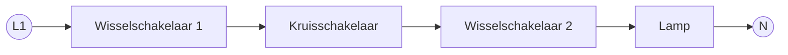
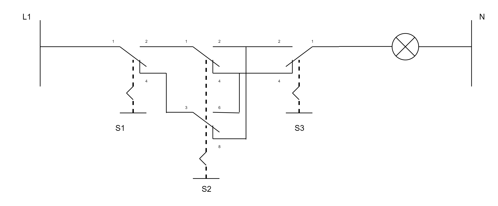
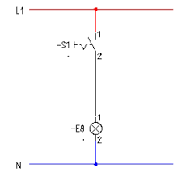
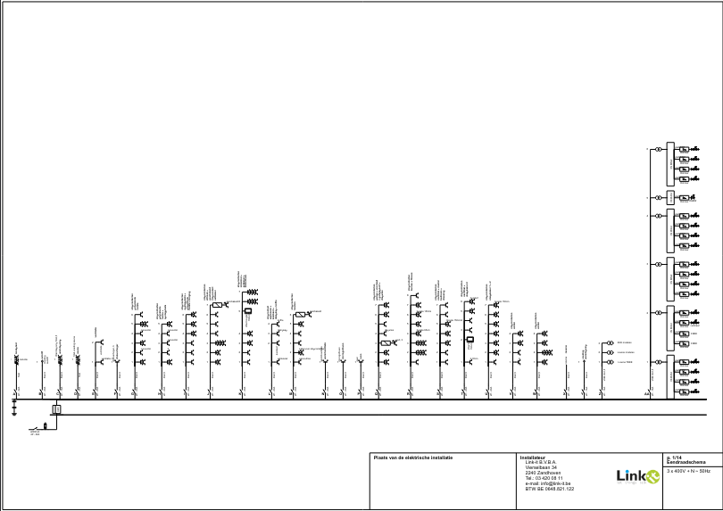
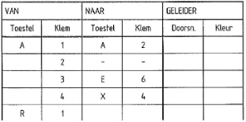
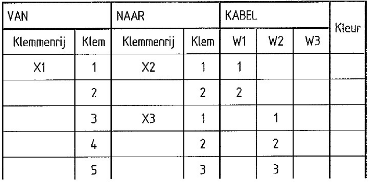
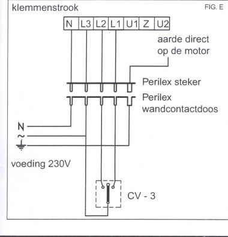
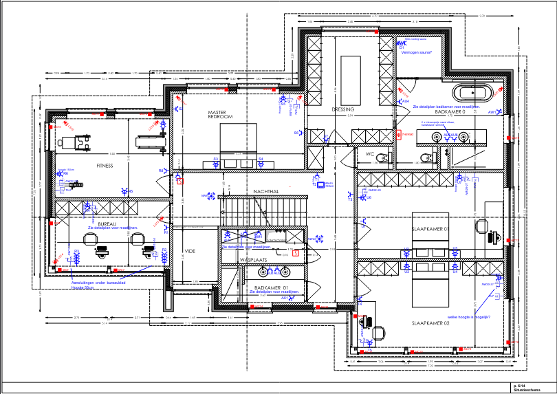

# Schema's: soorten en symbolen

## Waarom bestaan er zoveel soorten schema's?

Wie een installatie wil **begrijpen** (hoe werkt deze schakeling?) heeft iets anders nodig dan wie een installatie wil **uitvoeren** (welke draad hoort in welke buis, op welke klem?). Daarom bestaan er niet één, maar verschillende soorten schema's, elk met hun eigen doel. Om orde te scheppen in die veelheid, hangen we ze op aan twee assen.

## Schakelaars en drukknoppen: wat doen ze?

Voor je een schema zoals dat van een kruisschakeling kan lezen, moet je eerst weten wat de gebruikte schakelmechanismen zelf doen. Er is een fundamenteel onderscheid tussen twee families:

- **Schakelaars**: hebben een **blijvende stand** (aan of uit) die niet verandert tot je de schakelaar zelf opnieuw bedient. Ze schakelen de lamp rechtstreeks.
- **Drukknoppen**: geven enkel een **kort, tijdelijk contact** (een "impuls"). Zodra je loslaat, veert de knop vanzelf terug. Een drukknop schakelt op zich niets: hij geeft enkel een seintje door aan een relais dat de eigenlijke schakeling doet.

### De klassieke schakelaars

- **Enkelpolige schakelaar**: bedient **1 lichtpunt vanaf 1 plaats**. De meest eenvoudige schakeling, onderbreekt enkel de actieve geleider (fase).
- **Dubbelpolige schakelaar**: bedient ook 1 lichtpunt vanaf 1 plaats, maar onderbreekt **beide polen** (fase én nul). Wanneer dit wettelijk verplicht is (gekoppeld aan het type beveiliging aan het begin van de kring, niet aan de ruimte), zie thema "schakelaars" in installatieregels.md.
- **Serieschakelaar** (ook wel "dubbele aansteking" genoemd): bedient **2 afzonderlijke lichtpunten vanaf 1 plaats**, met één enkele wip die 3 standen kent (beide uit, groep 1, groep 1+2). Zie het stroombaanschema-voorbeeld hieronder.
- **Wisselschakelaar**: bedient **1 lichtpunt vanaf 2 plaatsen** (bijvoorbeeld boven- en onderaan een trap). Wordt altijd in paren gebruikt.
- **Kruisschakelaar**: wordt **tussen** twee wisselschakelaars geplaatst om **1 lichtpunt vanaf 3 of meer plaatsen** te bedienen. Hoe meer plaatsen je nodig hebt, hoe meer kruisschakelaars je tussen de twee wisselschakelaars plaatst.
- **Trekschakelaar**: een schakelaar die je via een geïsoleerd koord bedient in plaats van een drukknop of wip. Typisch gebruikt in een badkamer (volume 1/2), waar een gewone wandschakelaar niet toegelaten is maar een trekschakelaar met voldoende beschermingsgraad wel.
- **Dimmer**: laat toe de lichtsterkte van een lichtpunt traploos te regelen, in plaats van enkel aan/uit.

### Drukknop-gestuurde systemen

Bij grote installaties met veel bedieningspunten (bijvoorbeeld een trappenhal met een schakelaar op elke verdieping) wordt het onpraktisch om met kruisschakelaars te werken. Daarvoor bestaan systemen die met **drukknoppen** en een centraal relais werken:

- **Impulsschakelaar** (ook **teleruptor** of **stroomstootschakelaar** genoemd): een **bistabiel relais** dat van stand wisselt bij elke stroomstoot (impuls) die het van een drukknop krijgt, en die nieuwe stand vasthoudt tot de volgende impuls. Je kan er in principe een onbeperkt aantal drukknoppen op aansluiten, wat ideaal is voor trapverlichting met veel bedieningspunten.
- **Minuterie** (of tijdschakelaar/trapautomaat): werkt met dezelfde drukknoppen, maar schakelt het licht na een **ingestelde tijd automatisch weer uit**, in plaats van te wachten op een volgende impuls. Veelgebruikt in gemeenschappelijke delen (traphallen, gangen) om energie te besparen.

### Hoe zie je dit terug in een schema?

Een sterk vereenvoudigd voorbeeld van het principe van een kruisschakeling (L1 gaat via twee wisselschakelaars en een kruisschakelaar naar de lamp, terug via N):

En hetzelfde voorbeeld, in het echt getekend als stroombaanschema (L1 en N, met de wisselschakelaars S1/S3 en de kruisschakelaar S2, elk met hun klemnummers):

Ter vergelijking, het stroombaanschema van een eenvoudigere wisselschakeling en van een dubbele aansteking (de serieschakelaar van hierboven):

Een klein fragment van een stroombaanschema, met een enkele (enkelpolige) schakelaar S1 die een lamp E8 bedient tussen L1 en N (met de klemnummers 1/2 op de schakelaar en 1/2 op de lamp):

Dit soort schema, dat de werking van een schakeling toont, heet een **stroombaanschema**. Verderop in dit hoofdstuk leer je waarom dat precies de officiële AREI-term is, en hoe het zich verhoudt tot alle andere soorten schema's.

## Twee assen om schema's in te delen

### As 1: eendradig versus meerdradig

- **Eendradig (éénlijnig)**: elke stroombaan of leiding wordt getekend als **één lijn**, ongeacht hoeveel geleiders er werkelijk in zitten. Overzichtelijk, maar toont niet elke individuele draad.
- **Meerdradig (veellijnig)**: **elke geleider** wordt apart getekend. Minder overzichtelijk bij grote installaties, maar je ziet exact wat er waar loopt.

### As 2: controleschema's versus uitvoeringsondersteunende schema's

- **Controleschema's**: bedoeld om de **werking** van een schakeling te begrijpen of te verifiëren, los van waar alles fysiek hangt.
- **Uitvoeringsondersteunende schema's**: bedoeld om de installatie effectief te **monteren en aan te sluiten**, en volgen daarom de werkelijke, fysieke plaatsing.

Beide assen staan los van elkaar: een schema kan bijvoorbeeld meerdradig én uitvoeringsondersteunend zijn (het bedradingschema), of eendradig én een controleschema (het eendraadschema).

## De schema's stuk per stuk

### Stroombaanschema

De officiële, elektrotechnische term uit het AREI (Deel 2, Hoofdstuk 2.12): een **controleschema**, **meerdradig**, dat de elementaire stroombanen, hun onderlinge verbindingen en het elektrisch materieel weergeeft, met hun samenstelling en kenmerken.

Getekend tussen de twee voedingsdraden (L1 en N), toont het de **werking** van een schakeling (bijvoorbeeld hoe een kruisschakeling een lamp vanaf 3 plaatsen laat bedienen), volledig **los van de fysieke plaatsing** van de componenten. Dit is het schema dat je vanbuiten leert per type schakeling. De voorbeelden (kruisschakeling, wisselschakeling, dubbele aansteking,...) vind je hierboven bij "Schakelaars en drukknoppen: hoe zie je dit terug in een schema?".

Het AREI laat overigens toe dat een stroombaanschema **één- of meerdraads** getekend wordt. De eendradige toepassing ervan, verplicht voor huishoudelijke installaties, krijgt een eigen naam: het eendraadschema.

### Eendraadschema

De **eendradige, controlerende** vorm van het stroombaanschema, verplicht door het AREI voor elke nieuwe of belangrijk gewijzigde huishoudelijke installatie (zie AREI.md, Deel 3, onderafdeling 3.1.2.1). Elke stroombaan krijgt een hoofdletter, elk lichtpunt en elke contactdoos wordt genummerd in volgorde vanaf de beschermingsinrichting. Dit schema moet, samen met het situatieplan, ondertekend en gedateerd worden door de installateur en bewaard blijven in het dossier van de installatie.

Een reëel voorbeeld van een eendraadschema, zoals opgemaakt door een installateur (het officiële AREI-voorbeeld staat in Figuur 3.1):

### Leidingschema

**Uitvoeringsondersteunend**, **eendradig**. De lijnen stellen buizen voor, niet geleiders. Schuine streepjes op een lijn geven aan hoeveel geleiders er in die buis lopen.

**Let op**: in tegenstelling tot het stroombaanschema, het eendraadschema, het uitvoeringsschema en het situatieplan is het leidingschema **geen** term die het AREI zelf definieert of oplegt (zie Hoofdstuk 2.12 in AREI.md, waar dit begrip niet in voorkomt). Het is vooral een **didactisch hulpmiddel** uit het technisch onderwijs: je leert er eerst op herkennen om welke schakeling het gaat, en het is de brug tussen een leidingschema en een bedradingschema (samen met de bedradingslijst als tussenstap, zie verder) tijdens het aanleren van schakelingen. Een ervaren installateur op de werf tekent in de praktijk zelden een apart, volwaardig leidingschema uit; hij werkt eerder rechtstreeks vanuit het stroombaanschema en zijn ervaring. Voor jou als student is het wel nuttig: het dwingt je om na te denken over wat er waar fysiek moet liggen, vóór je een echt bedradingschema tekent.

### Bedradingslijst

Geen schema op zich, maar een **tussenstap**: een tabel die elke genummerde draad uit het stroombaanschema oplijst, met vermelding van waar de draad vertrekt (bijvoorbeeld een klem van de voeding) en waar hij toekomt (bijvoorbeeld klem 1 van een schakelaar).

| Draad-nr | Van | Naar |
|---|---|---|
| 1 | L1 | S1:1 |
| 2 | S1:2 | E1:1 |
| 3 | E1:2 | S1:4 |
| 4 | S1:3 | N |
| 5 | PE | E1:PE |

Een reëel voorbeeld van een bedradingslijst, met de gebruikte kabeldoorsnede en kleur per geleider:

### Bedradingschema

**Uitvoeringsondersteunend**, **meerdradig**. Toont exact welke draden er door welke buizen lopen, getekend op de werkelijke positie ten opzichte van de aftakdoos. **Dit is het schema dat je gebruikt om bijvoorbeeld bij een kruisschakeling alle kabels tussen de dozen te tonen**: je bouwt het op vanuit het leidingschema (waar zitten de buizen/dozen) en de bedradingslijst (welke draad gaat van waar naar waar).

**Leidingschema versus bedradingschema, het verschil in één zin**: het leidingschema (eendradig) toont enkel **hoeveel** geleiders er in een buis lopen (via de streepjes), zonder te zeggen welke dat precies zijn; het bedradingschema (meerdradig) toont **elke geleider afzonderlijk en met naam** (L1, N, de genummerde draad uit de bedradingslijst,...), getekend op zijn werkelijke plaats. Het leidingschema is dus een vereenvoudigd startpunt, het bedradingschema is het volledig uitgewerkte eindresultaat.

### Uitvoeringsschema

De officiële AREI-term (Deel 2, Hoofdstuk 2.12) voor een **uitvoeringsondersteunend** schema dat de montage en de aansluiting van de installatieonderdelen weergeeft.

Het AREI is hier bewust (of toch opvallend) vaag: deze ene zin is de volledige definitie. In tegenstelling tot het stroombaanschema en het situatieplan, die elk een eigen onderafdeling krijgen met bijzondere voorschriften over hun inhoud (onderafdeling 3.1.2.2 en 3.1.2.3), heeft "uitvoeringsschema" **geen** eigen uitgewerkte inhoudsvereisten in het AREI. Het functioneert eerder als een **overkoepelende, juridische verzamelterm**: alles wat je tekent om de montage/aansluiting effectief mogelijk te maken, valt eronder. In de praktijk zijn het **bedradingschema** en het **klemmenschema** de concrete documenten die je onder deze noemer daadwerkelijk tekent.

### Klemmenschema

**Uitvoeringsondersteunend**, meerdradig. Een praktische variant die zich toespitst op de aansluitklemmen van één specifiek toestel of bord: welke draad hoort op welk klemnummer.

Twee reële voorbeelden: een klemmenschema (van/naar-tabel met kabels W1/W2/W3) en een klemmenstrook (fysieke rij aansluitklemmen, hier van een Perilex-aansluiting):

### Situatieplan

**Uitvoeringsondersteunend**. Geen schema met lijnen, maar de **plattegrond** van de ruimte met de werkelijke locatie van elk lichtpunt, elke schakelaar en elke contactdoos. Verplicht door het AREI samen met het eendraadschema voor huishoudelijke installaties. De nummering sluit aan bij het eendraadschema: elk lichtpunt en elke contactdoos krijgt de letter van zijn stroombaan gevolgd door zijn nummer; elke schakelaar krijgt de letter van zijn stroombaan gevolgd door het nummer van het lichtpunt of toestel dat hij bedient.

Een reëel voorbeeld van een situatieplan (het officiële AREI-voorbeeld staat in Figuur 3.2):

## Grafische symbolen (AREI Tabel 2.23)

Het AREI legt in Hoofdstuk 2.13 (Deel 2) vast welke symbolen verplicht gebruikt worden voor het eendraadschema en het situatieplan van een huishoudelijke installatie. Deze symbolen zijn onderverdeeld in categorieën:

- **A. Algemeenheden**: gelijkstroom, wisselstroom, eenfasige en driefasige wisselstroom
- **B. Elektrische toestellen**: schakel- en verdeelbord, doos/inbouwdoos, verbindingsdoos/aftakdoos, aftakkast, aardingsonderbreker
- **C. Leidingen**: elektrische leiding (algemeen, ondergronds, luchtleiding, in een buis, in/op een wand), met streepjes voor het aantal geleiders (inclusief N en PE)
- **D. Beschermingstoestellen**: smeltveiligheid, automatische schakelaar (met letters M/O/Δ voor het uitklinkmechanisme), differentieelstroominrichting, aardelektrode
- **E. Schakelaars**: schakelaar, schakelaar met verklikkerlamp, een-/twee-/driepolige schakelaar, wisselschakelaar, kruisschakelaar, dimmer, trekschakelaar, drukknop, minuterie, impulsschakelaar, thermostaat
- **F. Contactdozen**: contactdoos (algemeen, meervoudig, waterdicht, met aarding, met kinderbescherming, met schakelaar)
- **G. Gebruikstoestellen**: lichtpunt, wandverlichting, fluorescentiearmatuur, noodverlichting, bel/zoemer/sirene, elektrisch slot, ventilator, verwarmingstoestel, boiler, elektrisch fornuis/kookplaat/oven, wasmachine, droogkast, afwasmachine, koelkast, diepvriezer, motor, transformator, kWh-teller

Voor het exacte grafische symbool van elk item raadpleeg je Tabel 2.23 in het AREI zelf, of de ingebouwde symbolenbibliotheek van **Trikker** of **diagrams.net**, die deze symbolen kant-en-klaar bevatten.
